# Playbook verificare manuală — producție

Ghid practic pentru validarea completă a aplicației **AstroAI 24/7** pe mediul live.

| | |
|---|---|
| **URL bază** | https://astro-ai-24-7.vercel.app |
| **Referințe** | [TEST_PLAN.md](../../TEST_PLAN.md) (detaliu atomic), [USER_FLOWS.md](./USER_FLOWS.md) (E2E), [billing-ops.md](../billing-ops.md) |
| **Ultima actualizare** | Versiune curentă (Sentry, Contact, landing auth, profile regen, compatibilitate ascunsă) |

---

## 0. Cum folosești documentul

### Priorități

| Nivel | Sesiuni | Timp estimat | Când |
|-------|---------|--------------|------|
| **P0 — Smoke** | A | ~30 min | Înainte de orice deploy / hotfix |
| **P1 — Core** | B, C, D, E, F, G, H | ~90 min | Release minor |
| **P2 — Business** | I, J, K | ~60 min | Stripe live / billing |
| **P3 — Ops** | L, M, N, O | ~30 min | Monitorizare, suport, i18n |

**Total complet:** ~55 teste, **3–4 ore**.

### Conturi recomandate

Pregătește înainte de sesiune:

1. **Cont Free** — profil cosmic complet, sub limita de întrebări lunare
2. **Cont Premium** — abonament activ (sau cumpără în sesiunea I)
3. **Email nou** — pentru register (sau șterge contul după test)
4. **Browser curat / incognito** — pentru teste auth și i18n

### Format checklist

Fiecare test are checkbox `- [ ]`. Notează data, tester, build Vercel, observații în coloana **Note**.

### Ce NU testăm pe producție (N/A)

- Tab **Compatibilitate** pe `/account` — ascuns temporar (`ACCOUNT_COMPATIBILITY_TAB_ENABLED=false`)
- E2E cu Firebase emulators — doar automat local
- Mock OpenAI/DivineAPI — doar în CI

---

## 1. Diagramă master — ordinea sesiunilor

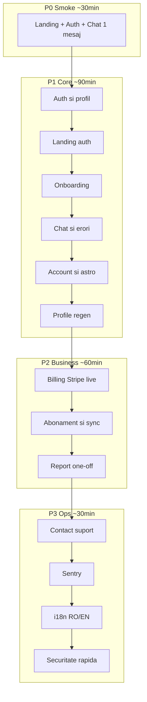

---

## Sesiunea A — Smoke P0

**Scop:** confirmă că aplicația e vie end-to-end.

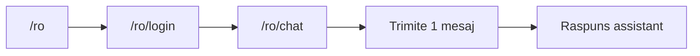

| ID | Test | P0 |
|----|------|-----|
| PROD-SMOKE-01 | Landing se încarcă | ✓ |
| PROD-SMOKE-02 | Login email/parolă | ✓ |
| PROD-SMOKE-03 | Redirect post-login | ✓ |
| PROD-SMOKE-04 | Chat se deschide | ✓ |
| PROD-SMOKE-05 | Mesaj + răspuns | ✓ |
| PROD-SMOKE-06 | Account se deschide | ✓ |

### PROD-SMOKE-01 — Landing se încarcă

**Pași:**
1. Deschide https://astro-ai-24-7.vercel.app/ro
2. Scroll scurt prin secțiuni (hero, agenți, pricing)

**Rezultat așteptat:** Pagina se încarcă fără eroare vizibilă; logo și nav vizibile.

- [ ] **Note:**

---

### PROD-SMOKE-02 — Login email/parolă

**Precondiții:** cont Free cu profil complet.

**Pași:**
1. `/ro/login`
2. Email + parolă valide → submit

**Rezultat așteptat:** Login reușit, fără mesaj de eroare.

**Referință:** AUTH-02

- [ ] **Note:**

---

### PROD-SMOKE-03 — Redirect post-login

**Pași:** Continuă de la PROD-SMOKE-02.

**Rezultat așteptat:** User cu profil complet ajunge pe **chat** sau **landing** (nu rămâne pe login); profil incomplet → **onboarding**.

- [ ] **Note:**

---

### PROD-SMOKE-04 — Chat se deschide

**Pași:**
1. Navighează la `/ro/chat`

**Rezultat așteptat:** UI chat vizibil (sidebar, input mesaj, agent activ).

- [ ] **Note:**

---

### PROD-SMOKE-05 — Mesaj + răspuns

**Pași:**
1. Scrie: „Care este semnul meu zodiacal?”
2. Trimite

**Rezultat așteptat:** Mesaj user apare; assistant răspunde (nu rămâne pe „streaming” indefinit); fără `deliveryStatus: failed`.

**Referință:** CHAT-02

- [ ] **Note:**

---

### PROD-SMOKE-06 — Account se deschide

**Pași:**
1. `/ro/account`

**Rezultat așteptat:** Hero cont, tab-uri vizibile (Overview, Profil cosmic, etc.).

- [ ] **Note:**

---

## Sesiunea B — Auth

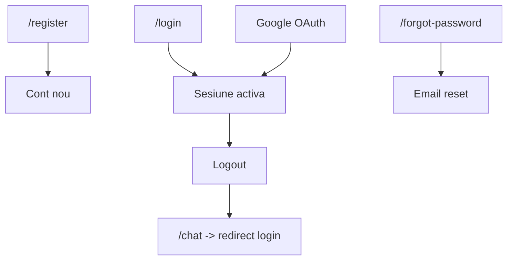

| ID | Test | Referință |
|----|------|-----------|
| PROD-AUTH-01 | Register cont nou | AUTH-01 |
| PROD-AUTH-02 | Login valid | AUTH-02 |
| PROD-AUTH-03 | Parolă greșită | AUTH-03 |
| PROD-AUTH-04 | Forgot password | AUTH (forgot) |
| PROD-AUTH-05 | Logout | AUTH-06 |
| PROD-AUTH-06 | Ruta protejată fără login | PROT-01 |
| PROD-AUTH-07 | Google login cont nou | AUTH-04 |
| PROD-AUTH-08 | Param `next` după login | AUTH-02 |

### PROD-AUTH-01 — Register cont nou

**Pași:**
1. `/ro/register` — email **nou**, parolă validă, nume
2. Submit

**Rezultat așteptat:** Cont creat; redirect onboarding sau chat; fără eroare Firebase.

- [ ] **Note:**

---

### PROD-AUTH-02 — Login valid

**Pași:** `/ro/login` cu cont existent.

**Rezultat așteptat:** Sesiune activă; redirect corect.

- [ ] **Note:**

---

### PROD-AUTH-03 — Parolă greșită

**Pași:** Login cu email valid + parolă greșită.

**Rezultat așteptat:** Mesaj eroare localizat RO; rămâi pe login.

- [ ] **Note:**

---

### PROD-AUTH-04 — Forgot password

**Pași:**
1. `/ro/login` → link „Ai uitat parola?”
2. `/ro/forgot-password` — email cont existent → submit

**Rezultat așteptat:** Mesaj succes (verifică inbox dacă vrei confirmare completă).

- [ ] **Note:**

---

### PROD-AUTH-05 — Logout

**Pași:**
1. Logat → `/ro/account` → Logout

**Rezultat așteptat:** Redirect landing/login; sesiune invalidată.

- [ ] **Note:**

---

### PROD-AUTH-06 — Ruta protejată fără login

**Pași:** Logout → accesează `/ro/chat` direct.

**Rezultat așteptat:** Redirect la login cu param `next`.

- [ ] **Note:**

---

### PROD-AUTH-07 — Google login (manual)

**Pași:** `/ro/register` sau login → „Continue with Google”.

**Rezultat așteptat:** OAuth reușit; user document creat; redirect corect.

- [ ] **Note:**

---

### PROD-AUTH-08 — Param `next` după login

**Pași:**
1. Logout → `/ro/login?next=/ro/account`
2. Login valid

**Rezultat așteptat:** După auth, ajungi pe `/ro/account` (sau onboarding dacă profil incomplet).

- [ ] **Note:**

---

## Sesiunea C — Landing auth (logat)

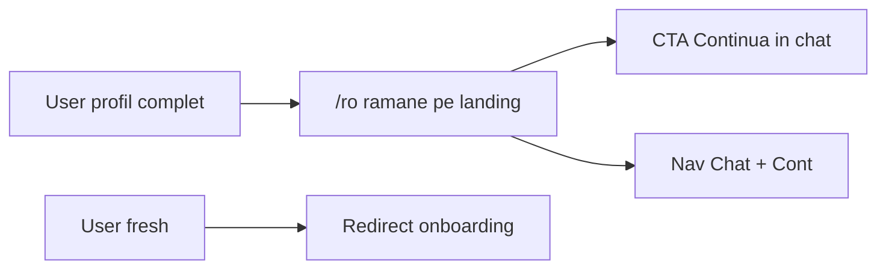

| ID | Test | Referință E2E |
|----|------|---------------|
| PROD-LAND-01 | Profil complet rămâne pe landing | LAND-01 |
| PROD-LAND-02 | CTA chat funcțional | LAND-01/02 |
| PROD-LAND-03 | User fresh → onboarding | LAND-03 |
| PROD-LAND-04 | Free vede CTA planuri | LAND-04 |

### PROD-LAND-01 — Profil complet rămâne pe landing

**Precondiții:** Logat, profil complet.

**Pași:** `/ro` (landing)

**Rezultat așteptat:** **Nu** ești redirectat forțat la chat; rămâi pe landing.

- [ ] **Note:**

---

### PROD-LAND-02 — CTA chat funcțional

**Pași:** De pe landing logat → click CTA chat / nav Chat.

**Rezultat așteptat:** Ajungi pe `/ro/chat`.

- [ ] **Note:**

---

### PROD-LAND-03 — User fresh → onboarding

**Precondiții:** Cont nou fără profil complet.

**Pași:** `/ro` sau login fresh.

**Rezultat așteptat:** Redirect către onboarding (nu chat).

- [ ] **Note:**

---

### PROD-LAND-04 — Free vede CTA planuri

**Precondiții:** Cont Free logat.

**Pași:** Landing → secțiune pricing / CTA planuri.

**Rezultat așteptat:** Link către pricing sau billing vizibil (ex. „Vezi planurile”).

- [ ] **Note:**

---

## Sesiunea D — Onboarding

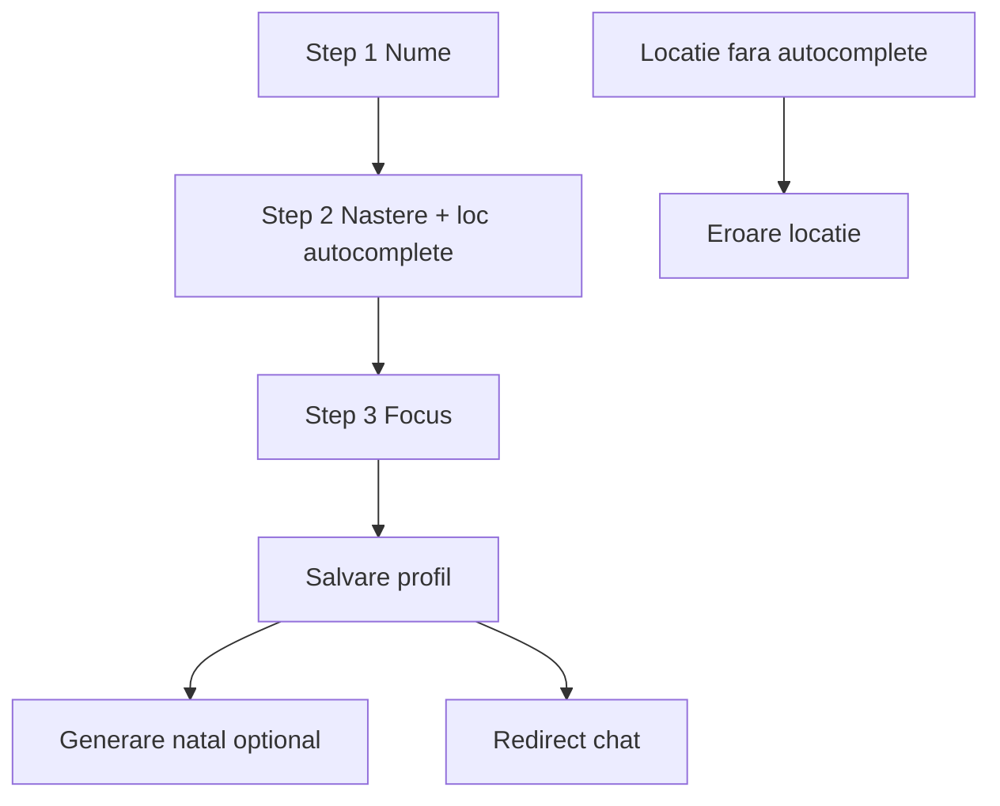

| ID | Test | Referință |
|----|------|-----------|
| PROD-ONB-01 | Wizard complet | ONB-01 |
| PROD-ONB-02 | Locație nevalidată | ONB-02 |
| PROD-ONB-03 | Profil complet skip onboarding | ONB-03 |
| PROD-ONB-04 | Autocomplete loc naștere | ONB-01 |

### PROD-ONB-01 — Wizard complet

**Precondiții:** Cont nou sau profil incomplet.

**Pași:** Completează cei 3 pași → submit final.

**Rezultat așteptat:** Profil salvat; redirect chat; eventual animație divine/natal.

- [ ] **Note:**

---

### PROD-ONB-02 — Locație nevalidată

**Pași:** La loc naștere, tastează text **fără** select din sugestii → submit.

**Rezultat așteptat:** Eroare loc naștere; profil **nu** se salvează.

- [ ] **Note:**

---

### PROD-ONB-03 — Profil complet skip onboarding

**Pași:** User complet accesează `/ro/onboarding`.

**Rezultat așteptat:** Redirect automat la chat (sau account).

- [ ] **Note:**

---

### PROD-ONB-04 — Autocomplete loc naștere

**Pași:** Step 2 → tastează oraș → selectează din listă Google Places.

**Rezultat așteptat:** Locație rezolvată; submit reușit.

- [ ] **Note:**

---

## Sesiunea E — Chat

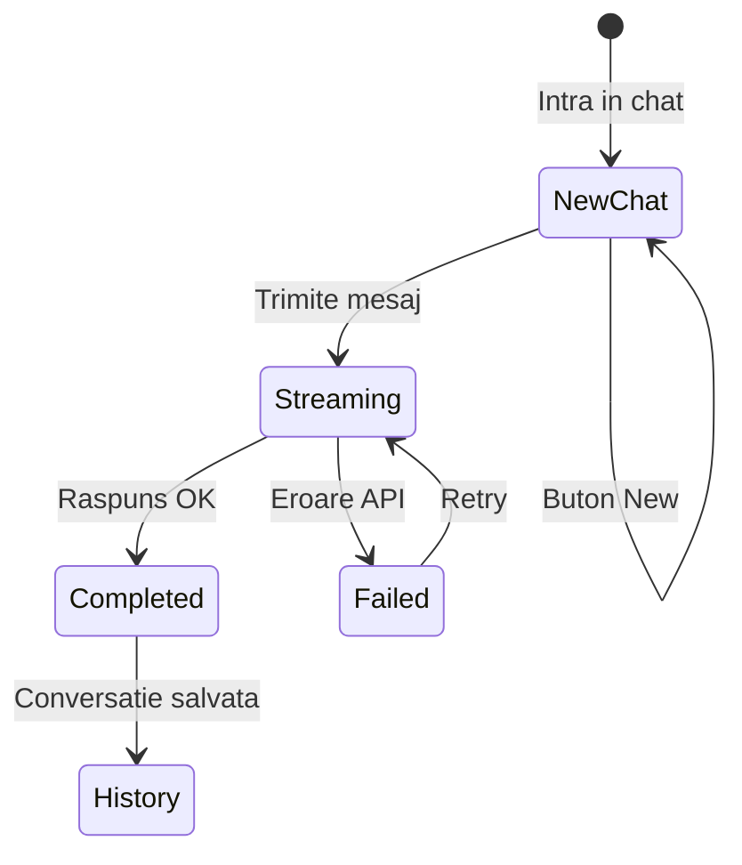

| ID | Test | Referință |
|----|------|-----------|
| PROD-CHAT-01 | Stare new chat | CHAT-01 |
| PROD-CHAT-02 | Mesaj simplu | CHAT-02 |
| PROD-CHAT-03 | Suggested prompt | CHAT-03 |
| PROD-CHAT-04 | Schimbare agent | AGENT-01 |
| PROD-CHAT-05 | Chat nou (New) | NEWCHAT-01 |
| PROD-CHAT-06 | Istoric conversație | HIST-02 |
| PROD-CHAT-07 | Stop send | manual |
| PROD-CHAT-08 | Limită free (dacă aplicabil) | CHAT-04 |

### PROD-CHAT-01 — Stare new chat

**Pași:** `/ro/chat` — fără conversație selectată.

**Rezultat așteptat:** UI „chat nou”; input focus; fără mesaje vechi încărcate greșit.

- [ ] **Note:**

---

### PROD-CHAT-02 — Mesaj simplu

**Pași:** Trimite întrebare scurtă despre harta natală.

**Rezultat așteptat:** Răspuns complet; fără failed.

- [ ] **Note:**

---

### PROD-CHAT-03 — Suggested prompt

**Pași:** Click pe un prompt sugerat din UI.

**Rezultat așteptat:** Mesaj trimis automat; răspuns primit.

- [ ] **Note:**

---

### PROD-CHAT-04 — Schimbare agent

**Pași:** Selectează alt agent din sidebar → trimite mesaj.

**Rezultat așteptat:** Răspuns de la agentul selectat; etichetă agent corectă.

- [ ] **Note:**

---

### PROD-CHAT-05 — Chat nou (New)

**Pași:**
1. După un mesaj reușit → click **New**
2. Trimite mesaj nou

**Rezultat așteptat:** Context resetat; conversație nouă; fără amestec mesaje vechi.

- [ ] **Note:**

---

### PROD-CHAT-06 — Istoric conversație

**Pași:**
1. Sidebar → deschide conversație anterioară

**Rezultat așteptat:** Mesajele se încarcă corect.

- [ ] **Note:**

---

### PROD-CHAT-07 — Stop send

**Pași:** Trimite mesaj lung → apasă Stop în timpul streaming.

**Rezultat așteptat:** Generare oprită; UI nu rămâne blocat; opțiune retry.

- [ ] **Note:**

---

### PROD-CHAT-08 — Limită free

**Precondiții:** Cont Free la limita lunară de întrebări.

**Pași:** Trimite mesaj.

**Rezultat așteptat:** Mesaj eroare usage limit; CTA Premium; **fără** răspuns AI.

- [ ] **Note:**

---

## Sesiunea F — Account (tab-uri)

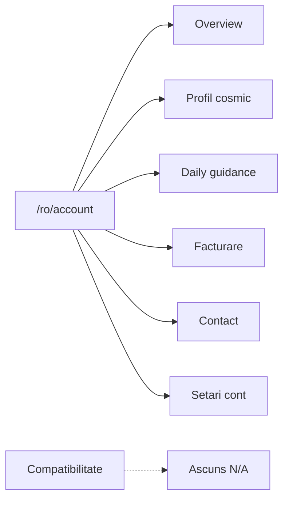

| ID | Test |
|----|------|
| PROD-ACCT-01 | Tab Overview |
| PROD-ACCT-02 | Tab Profil cosmic — salvare |
| PROD-ACCT-03 | Tab Daily guidance |
| PROD-ACCT-04 | Tab Facturare |
| PROD-ACCT-05 | Tab Contact vizibil |
| PROD-ACCT-06 | Tab Compatibilitate absent |

### PROD-ACCT-01 — Tab Overview

**Pași:** `/ro/account` — tab Overview.

**Rezultat așteptat:** Plan curent, focus, usage meter (Free), linkuri rapide.

- [ ] **Note:**

---

### PROD-ACCT-02 — Profil cosmic — salvare nume

**Pași:**
1. Tab Profil cosmic → schimbă doar **numele** → Save

**Rezultat așteptat:** Mesaj succes; rămâi pe account; **fără** redirect onboarding divine.

**Referință:** PROF-REGEN-02

- [ ] **Note:**

---

### PROD-ACCT-03 — Tab Daily guidance

**Pași:** Tab Ghid zilnic.

**Rezultat așteptat:** Conținut daily sau CTA generare; fără crash.

- [ ] **Note:**

---

### PROD-ACCT-04 — Tab Facturare

**Pași:** Tab Facturare.

**Rezultat așteptat:** Status abonament, link billing setup / portal.

- [ ] **Note:**

---

### PROD-ACCT-05 — Tab Contact vizibil

**Pași:** `/ro/account?tab=contact`

**Rezultat așteptat:** Formular contact cu topicuri; fără 404.

- [ ] **Note:**

---

### PROD-ACCT-06 — Tab Compatibilitate absent

**Pași:** Verifică lista tab-urilor pe account.

**Rezultat așteptat:** **Nu** există tab Compatibilitate (ascuns intenționat).

- [ ] **Note:**

---

## Sesiunea G — Profile regen (astro)

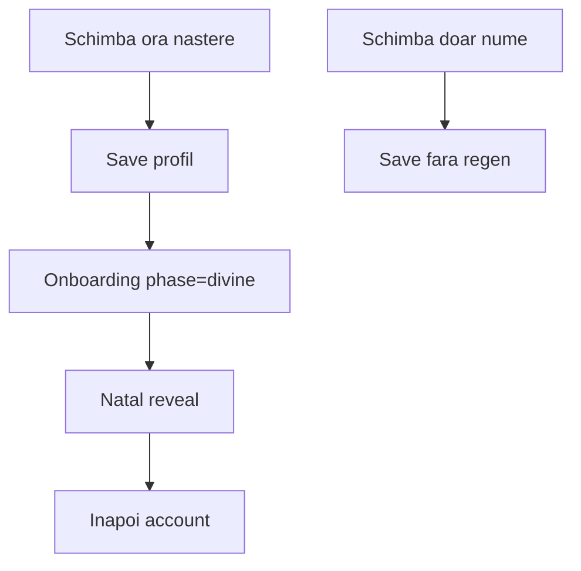

| ID | Test | Referință E2E |
|----|------|---------------|
| PROD-REGEN-01 | Schimbare câmp astro → divine | PROF-REGEN-01 |
| PROD-REGEN-02 | Schimbare doar nume | PROF-REGEN-02 |

### PROD-REGEN-01 — Schimbare câmp astro

**Pași:**
1. Profil cosmic → schimbă **ora nașterii** (sau dată/loc) → Save

**Rezultat așteptat:** Redirect `/onboarding?phase=divine&source=account` → animație → reveal → înapoi account.

- [ ] **Note:**

---

### PROD-REGEN-02 — Schimbare doar nume

**Pași:** Schimbă doar numele → Save.

**Rezultat așteptat:** Rămâi pe account; mesaj salvare; **fără** flow divine.

- [ ] **Note:**

---

## Sesiunea H — Astro / insights

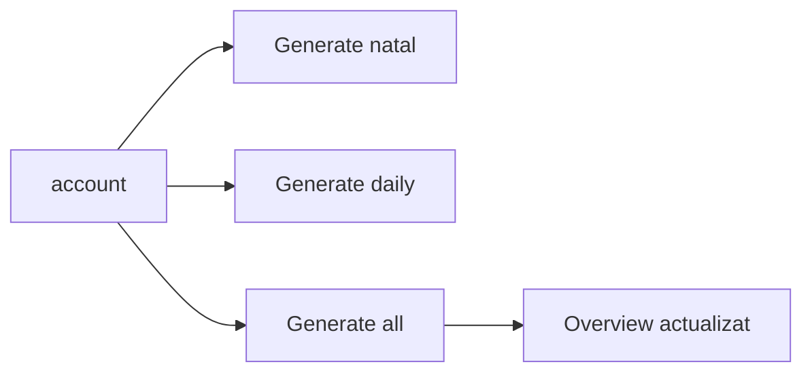

| ID | Test | Referință |
|----|------|-----------|
| PROD-ASTRO-01 | Generate natal | ASTRO-01 |
| PROD-ASTRO-02 | Generate daily | ASTRO-03 |
| PROD-ASTRO-03 | Generate all | ASTRO-04 |
| PROD-ASTRO-04 | Overview afișează semne | ASTRO-05 |
| PROD-ASTRO-05 | Refresh fără crash | ASTRO-02 |

### PROD-ASTRO-01 — Generate natal

**Pași:** Account → insights → Generate natal chart.

**Rezultat așteptat:** Loading → hartă/summary vizibil; fără eroare persistentă.

- [ ] **Note:**

---

### PROD-ASTRO-02 — Generate daily

**Pași:** Generate / refresh daily guidance.

**Rezultat așteptat:** Text ghid zilnic apare.

- [ ] **Note:**

---

### PROD-ASTRO-03 — Generate all

**Pași:** „Generate all insights”.

**Rezultat așteptat:** Natal + daily regenerate; feedback succes.

- [ ] **Note:**

---

### PROD-ASTRO-04 — Overview semne

**Pași:** Verifică Sun/Moon/Rising în overview.

**Rezultat așteptat:** Valori populate după generare natal.

- [ ] **Note:**

---

### PROD-ASTRO-05 — Refresh fără crash

**Pași:** Apasă refresh natal a doua oară.

**Rezultat așteptat:** Re-generare OK; UI stabil.

- [ ] **Note:**

---

## Sesiunea I — Billing Stripe live

**Atenție:** plăți **reale** (RON). Folosește card real sau anulează imediat după test.

**Pre-check env Vercel (Production):**
- [ ] `STRIPE_SECRET_KEY` = `sk_live_...`
- [ ] `STRIPE_WEBHOOK_SECRET` = webhook live
- [ ] `STRIPE_PRICE_PREMIUM_*_RON` = price IDs live
- [ ] Webhook activ către `/api/stripe/webhook`

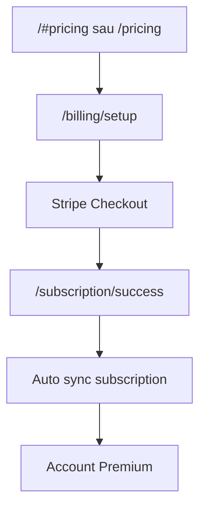

| ID | Test |
|----|------|
| PROD-BILL-01 | Pricing vizibil |
| PROD-BILL-02 | Billing setup complet |
| PROD-BILL-03 | Checkout Premium lunar |
| PROD-BILL-04 | Success page + sync |
| PROD-BILL-05 | Account arată Premium |
| PROD-BILL-06 | Refresh status manual |

### PROD-BILL-01 — Pricing vizibil

**Pași:** `/ro#pricing` sau secțiune pricing landing.

**Rezultat așteptat:** Planuri Free/Premium; prețuri RON; CTA checkout.

- [ ] **Note:**

---

### PROD-BILL-02 — Billing setup

**Pași:** `/ro/billing/setup` — completează date facturare obligatorii.

**Rezultat așteptat:** Salvare reușită; necesar înainte de checkout.

- [ ] **Note:**

---

### PROD-BILL-03 — Checkout Premium

**Precondiții:** Billing setup complet.

**Pași:** Activează Premium lunar → Stripe Checkout → plată.

**Rezultat așteptat:** Plată reușită în Stripe Dashboard (live).

- [ ] **Note:**

---

### PROD-BILL-04 — Success + sync

**Pași:** După plată → pagina success.

**Rezultat așteptat:** Redirect success; sync subscription rulează; fără eroare vizibilă.

- [ ] **Note:**

---

### PROD-BILL-05 — Account Premium

**Pași:** `/ro/account` → tab Overview / Facturare.

**Rezultat așteptat:** Plan **Premium**; limită întrebări ridicată/eliminată.

- [ ] **Note:**

---

### PROD-BILL-06 — Refresh status manual

**Pași:** Dacă plan încă arată Free → click „Reîmprospătează statusul”.

**Rezultat așteptat:** Status se actualizează la Premium.

- [ ] **Note:**

---

## Sesiunea J — Subscription

| ID | Test |
|----|------|
| PROD-SUB-01 | Usage meter Free |
| PROD-SUB-02 | CTA upgrade din chat |
| PROD-SUB-03 | Billing portal (Premium) |
| PROD-SUB-04 | Pagina /subscription |

### PROD-SUB-01 — Usage meter Free

**Precondiții:** Cont Free.

**Pași:** Account overview + chat sidebar usage.

**Rezultat așteptat:** Contor întrebări lunare corect.

- [ ] **Note:**

---

### PROD-SUB-02 — CTA upgrade din chat

**Precondiții:** Free aproape/a depășit limita.

**Pași:** Verifică CTA Premium în chat.

**Rezultat așteptat:** Link funcțional către pricing/checkout.

- [ ] **Note:**

---

### PROD-SUB-03 — Billing portal

**Precondiții:** Cont Premium.

**Pași:** Account → gestionează abonament / portal Stripe.

**Rezultat așteptat:** Stripe Customer Portal se deschide.

- [ ] **Note:**

---

### PROD-SUB-04 — Pagina subscription

**Pași:** `/ro/subscription`

**Rezultat așteptat:** Detalii plan; fără crash.

- [ ] **Note:**

---

## Sesiunea K — Report one-off (opțional)

| ID | Test |
|----|------|
| PROD-REP-01 | Pagina report |
| PROD-REP-02 | Checkout report (dacă activ) |

### PROD-REP-01 — Pagina report

**Pași:** `/ro/report`

**Rezultat așteptat:** Pagina se încarcă; CTA purchase vizibil dacă produsul e activ.

- [ ] **Note:**

---

### PROD-REP-02 — Checkout report

**Pași:** Initiere cumpărare report (dacă configurat Stripe).

**Rezultat așteptat:** Checkout Stripe sau mesaj clar dacă indisponibil.

- [ ] **Note:**

---

## Sesiunea L — Contact suport

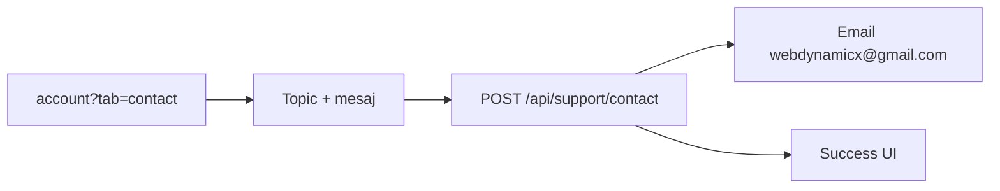

| ID | Test |
|----|------|
| PROD-CONTACT-01 | Trimite mesaj contact |
| PROD-CONTACT-02 | Validare mesaj scurt |

### PROD-CONTACT-01 — Trimite mesaj contact

**Precondiții:** Logat; SMTP configurat pe Vercel.

**Pași:**
1. `/ro/account?tab=contact`
2. Selectează topic → mesaj ≥10 caractere → Trimite

**Rezultat așteptat:** UI „Mesaj trimis”; email primit la webdynamicx@gmail.com (verifică inbox).

- [ ] **Note:**

---

### PROD-CONTACT-02 — Validare mesaj scurt

**Pași:** Mesaj <10 caractere → submit.

**Rezultat așteptat:** Buton dezactivat sau eroare validare; fără trimitere.

- [ ] **Note:**

---

## Sesiunea M — Sentry

**Precondiții Vercel:** `NEXT_PUBLIC_SENTRY_DSN`, `SENTRY_DSN`, `SENTRY_ENVIRONMENT=production`, `SENTRY_EXAMPLE_SECRET`.

| ID | Test |
|----|------|
| PROD-SENTRY-01 | Pagină test ascunsă |
| PROD-SENTRY-02 | Issue în dashboard |

### PROD-SENTRY-01 — Pagină test ascunsă

**Pași:**
1. `/sentry-example-page` **fără** key → trebuie 404
2. `/sentry-example-page?key={SENTRY_EXAMPLE_SECRET}` → pagină vizibilă
3. Click „Trigger client error”

**Rezultat așteptat:** 404 fără secret; cu secret, butoane funcționale.

- [ ] **Note:**

---

### PROD-SENTRY-02 — Issue în dashboard

**Pași:** După PROD-SENTRY-01 → Sentry.io → Issues (environment `production`).

**Rezultat așteptat:** Issue nou în câteva secunde/minute.

- [ ] **Note:**

---

## Sesiunea N — i18n

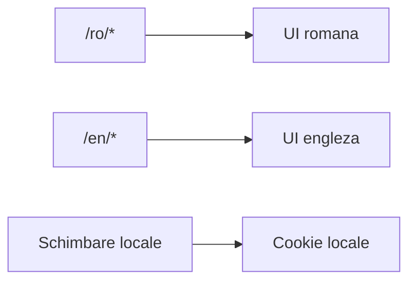

| ID | Test |
|----|------|
| PROD-I18N-01 | Rute RO |
| PROD-I18N-02 | Rute EN |
| PROD-I18N-03 | Switch locale |
| PROD-I18N-04 | Erori chat RO |

### PROD-I18N-01 — Rute RO

**Pași:** `/ro/chat`, `/ro/account`, `/ro/login`

**Rezultat așteptat:** Conținut predominant română.

- [ ] **Note:**

---

### PROD-I18N-02 — Rute EN

**Pași:** `/en/chat`, `/en/account`

**Rezultat așteptat:** Conținut engleză.

- [ ] **Note:**

---

### PROD-I18N-03 — Switch locale

**Pași:** Schimbă limba din UI (dacă există toggle) sau accesează `/en` după `/ro`.

**Rezultat așteptat:** Locale persistă (cookie); URL prefix corect.

- [ ] **Note:**

---

### PROD-I18N-04 — Erori chat RO

**Pași:** Pe `/ro/chat`, provoacă eroare (ex. mesaj prea lung sau limită).

**Rezultat așteptat:** Mesaj eroare în română.

- [ ] **Note:**

---

## Sesiunea O — Securitate rapidă

| ID | Test |
|----|------|
| PROD-SEC-01 | /chat fără auth |
| PROD-SEC-02 | /account fără auth |
| PROD-SEC-03 | Sentry page fără secret |
| PROD-SEC-04 | API contact fără auth |

### PROD-SEC-01 — /chat fără auth

**Pași:** Incognito → `/ro/chat`

**Rezultat așteptat:** Redirect login.

- [ ] **Note:**

---

### PROD-SEC-02 — /account fără auth

**Pași:** Incognito → `/ro/account`

**Rezultat așteptat:** Redirect login.

- [ ] **Note:**

---

### PROD-SEC-03 — Sentry page fără secret

**Pași:** `/sentry-example-page` fără query.

**Rezultat așteptat:** 404 Not Found.

- [ ] **Note:**

---

### PROD-SEC-04 — API contact fără auth

**Pași:** (Opțional, curl) `POST /api/support/contact` fără Bearer token.

**Rezultat așteptat:** 401 unauthenticated.

- [ ] **Note:**

---

## 2. Matrice sumar

| Zonă | P0 | Total | E2E automat | TEST_PLAN |
|------|-----|-------|-------------|-----------|
| A — Smoke | 6 | 6 | parțial | CHAT-02, AUTH-02 |
| B — Auth | 2 | 8 | parțial | AUTH-* |
| C — Landing | 0 | 4 | da | LAND-* |
| D — Onboarding | 0 | 4 | parțial | ONB-* |
| E — Chat | 1 | 8 | da | CHAT-*, HIST-* |
| F — Account | 1 | 6 | parțial | — |
| G — Profile regen | 0 | 2 | da | PROF-REGEN-* |
| H — Astro | 0 | 5 | parțial | ASTRO-* |
| I — Billing | 0 | 6 | nu | manual |
| J — Subscription | 0 | 4 | nu | manual |
| K — Report | 0 | 2 | nu | optional |
| L — Contact | 0 | 2 | da | CONTACT-01 |
| M — Sentry | 0 | 2 | nu | — |
| N — i18n | 0 | 4 | da | i18n.spec |
| O — Securitate | 0 | 4 | parțial | PROT-* |
| **Total** | **10** | **67** | | |

---

## 3. Fișă rulare release

| Câmp | Valoare |
|------|---------|
| Data | |
| Tester | |
| Build / deploy Vercel | |
| P0 trecut | ☐ Da ☐ Nu |
| P1 trecut | ☐ Da ☐ Nu ☐ Parțial |
| P2 trecut | ☐ Da ☐ Nu ☐ N/A |
| P3 trecut | ☐ Da ☐ Nu ☐ Parțial |
| Blocker găsit | |
| Go / No-Go | |

---

## 4. Automatizare complementară

Pentru regresie rapidă locală (nu înlocuiește acest playbook pe producție):

```bash
npm run emulators   # terminal 1
npm run test:e2e    # terminal 2
```

Vezi [USER_FLOWS.md](./USER_FLOWS.md) pentru maparea completă flux → spec E2E.
