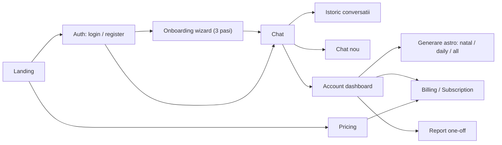

# Fluxuri utilizator si teste functionale (E2E)

Document concis care identifica fluxurile principale ale aplicatiei si le mapeaza
la testele functionale. Cazurile de testare manuale detaliate raman in
[`TEST_PLAN.md`](../../TEST_PLAN.md), iar inventarul de functionalitati si
riscuri in [`QA_AUDIT.md`](../../QA_AUDIT.md). Acest document nu le duplica, ci le
leaga de automatizarea Playwright din `e2e/`.

## Context tehnic

- Next.js 16 (App Router), i18n `ro`/`en` cu rute prefixate de locale.
- Firebase Auth + Firestore; toata persistenta trece prin Admin SDK pe server.
- Integrari externe: OpenAI, DivineAPI, Google Maps, Stripe, Oblio.
- Pentru E2E: Firebase emulators + `E2E_MOCK_EXTERNALS=1` (mock OpenAI/DivineAPI
  in rutele API) + stub la nivel de retea pentru Google Maps in testul de
  onboarding.

## Fluxuri principale



1. Autentificare: register/login email+parola, login Google, logout, rutare
   post-auth (profil incomplet -> onboarding, profil complet -> chat).
2. Onboarding: wizard in 3 pasi (nume, detalii nastere + loc rezolvat, focus),
   salvare profil, redirect la chat.
3. Chat: stare "new chat" la intrare, trimitere mesaj, suggested prompts,
   selectare agent, CTA generare date divine.
4. Chat nou / Istoric: buton New, listare/deschidere conversatii, load more.
5. Account + generare astro: profil, readings, natal/daily/generate-all,
   compatibilitate.
6. Pagini protejate / rutare: AuthGuard redirectioneaza la login cu `next`;
   locale necunoscut -> 404.
7. i18n: rute `/ro` si `/en`, persistenta locale prin cookie.
8. Billing / Pricing / Subscription / Report (Stripe).

## Strategia de automatizare

- Automatizat cu emulator + mock: Auth, Onboarding, Chat, Chat nou, Istoric,
  Account (astro), Pagini protejate, i18n.
- Ramane manual (Stripe/Oblio neacoperite inca de mock-uri): checkout Premium,
  billing setup, report purchase/consume, subscription portal, webhook-uri.
  Aceste fluxuri au deja `data-testid` adaugate (pricing/report/billing) pentru
  a fi usor de automatizat ulterior.
- Autentificare in teste: login real prin UI cu conturile seed (helper `loginAs`
  in `e2e/fixtures/test.ts`). Sesiunea Firebase sta in IndexedDB, deci nu se
  reutilizeaza `storageState`.

## Maparea flux -> test

| Flux | ID test | Tip | Spec |
| --- | --- | --- | --- |
| Auth: login valid | AUTH-02 | automat | [auth.spec.ts](../../e2e/specs/auth.spec.ts) |
| Auth: parola gresita | AUTH-03 | automat | [auth.spec.ts](../../e2e/specs/auth.spec.ts) |
| Auth: register cont nou | AUTH-01 | automat | [auth.spec.ts](../../e2e/specs/auth.spec.ts) |
| Auth: logout | AUTH-06 | automat | [auth.spec.ts](../../e2e/specs/auth.spec.ts) |
| Auth: Google login | AUTH-04/05 | manual | TEST_PLAN.md |
| Onboarding complet | ONB-01 | automat | [onboarding.spec.ts](../../e2e/specs/onboarding.spec.ts) |
| Onboarding: profil complet -> redirect | ONB-03 | automat | [onboarding.spec.ts](../../e2e/specs/onboarding.spec.ts) |
| Onboarding: locatie nevalidata | ONB-02 | manual | TEST_PLAN.md |
| Chat: stare new | CHAT-01 | automat | [chat.spec.ts](../../e2e/specs/chat.spec.ts) |
| Chat: trimitere mesaj | CHAT-02 | automat | [chat.spec.ts](../../e2e/specs/chat.spec.ts) |
| Chat: suggested prompt | CHAT-03 | automat | [chat.spec.ts](../../e2e/specs/chat.spec.ts) |
| Chat: selectare agent | AGENT-01 | automat | [chat.spec.ts](../../e2e/specs/chat.spec.ts) |
| Chat: usage limit / CTA divine | CHAT-04/05 | manual | TEST_PLAN.md |
| Istoric: listare | HIST-01 | automat | [chat-history.spec.ts](../../e2e/specs/chat-history.spec.ts) |
| Istoric: deschidere conversatie | HIST-02 | automat | [chat-history.spec.ts](../../e2e/specs/chat-history.spec.ts) |
| Chat nou: reset context | NEWCHAT-01 | automat | [chat-history.spec.ts](../../e2e/specs/chat-history.spec.ts) |
| Chat nou: fara auto-open | NEWCHAT-03 | automat | [chat-history.spec.ts](../../e2e/specs/chat-history.spec.ts) |
| Astro: generate all | ASTRO-04 | automat | [account-astrology.spec.ts](../../e2e/specs/account-astrology.spec.ts) |
| Astro: natal | ASTRO-01 | automat | [account-astrology.spec.ts](../../e2e/specs/account-astrology.spec.ts) |
| Astro: daily / compatibilitate | ASTRO-03 / SYN-* | manual | TEST_PLAN.md |
| Protectie rute (chat/account/report) | PROT-01..03 | automat | [protected-routes.spec.ts](../../e2e/specs/protected-routes.spec.ts) |
| Locale necunoscut -> 404 | EDGE-05 | automat | [protected-routes.spec.ts](../../e2e/specs/protected-routes.spec.ts) |
| i18n: rute + persistenta locale | ONB-06 / UX | automat | [i18n.spec.ts](../../e2e/specs/i18n.spec.ts) |
| Pricing / Billing / Report / Subscription | MOB-04 / ERR-03 | manual | TEST_PLAN.md |

## Cum se ruleaza

Sunt necesare trei pasi (emulatoarele ruleaza separat de aplicatie):

```bash
# 1) Porneste emulatoarele Firebase (terminal dedicat)
npm run emulators

# 2) Optional: seed manual (global setup-ul Playwright face reset+seed automat)
npm run e2e:seed

# 3) Ruleaza testele (porneste automat `next dev` cu env-ul E2E)
npm run test:e2e
# sau UI mode:
npm run test:e2e:ui
```

Note:
- Prima rulare necesita binarele Playwright: `npx playwright install chromium`.
- Environment-ul E2E e definit in [`e2e/env.ts`](../../e2e/env.ts) (valori
  non-secrete, emulator + mock). Se poate suprascrie cu un fisier local
  `.env.e2e` (vezi [`.env.e2e.example`](../../.env.e2e.example)).
- Proiectul Firebase trebuie sa fie `demo-*` (obligatoriu pentru emulator).

## Limitari cunoscute

- Stripe/Oblio nu sunt inca mock-uite, deci fluxurile de plata raman manuale.
- Conturile seed sunt partajate intre teste in cadrul unei rulari; testele sunt
  scrise sa fie independente de ordine si ruleaza serial (`workers: 1`). Global
  setup-ul face reset+seed la inceputul fiecarei rulari.
